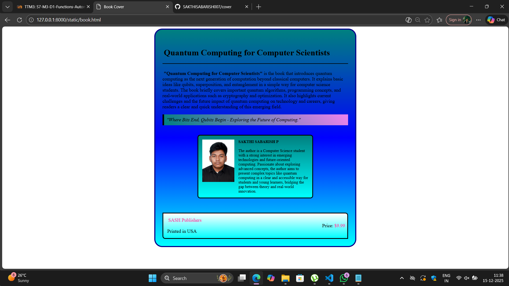

# Ex.05 Book Cover Page Design
## Date:15-12-2025

## AIM:
To design a book back cover page using HTML and CSS.

## DESIGN STEPS:

### Step 1:
Create a Django Admin project.

### Step 2:
Create an app in the Django interface.

### Step 3:
Create a folder named 'static' in the app folder.

### Step 4:
Create a new HTML file in the static folder.

### Step 5:
Write the HTML code with relevant CSS properties.

### Step 6:
Choose the appropriate style and color scheme.

### Step 7:
Insert the images in their appropriate places.

### Step 8:
Publish the website in the LocalHost.

## PROGRAM:
```
<html>
    <head>
        <title>Book Cover</title>
        <link href="styles.css" rel="stylesheet">
    </head>
    <body class="id1">
        <div class="id3">
            <h1>Quantum Computing for Computer Scientists</h1>
            <hr color="black" size="2">
            <br>
           <font class="id2">"Quantum Computing for Computer Scientists"</font><font>is the book that introduces quantum computing as the next generation of computation beyond classical computers. It explains basic ideas like qubits, superposition, and entanglement in a simple way for computer science students. The book briefly covers important quantum algorithms, programming concepts, and real-world applications such as cryptography and optimization. It also highlights current challenges and the future impact of quantum computing on technology and careers, giving readers a clear and quick understanding of this emerging field.</font>
            <div>
                <br>
                <font class="id4">"Where Bits End, Qubits Begin - Exploring the Future of Computing."</font>
            </div>
            <br><br>
            <div class="id5">
                
                <div class="id6">
                    <b>SAKTHI SABARISH P</b>
                    <br><br>
                    The author is a Computer Science student with a strong interest in emerging technologies and future-oriented computing. Passionate about exploring advanced concepts, the author aims to present complex topics like quantum computing in a clear and accessible way for students and young learners, bridging the gap between theory and real-world innovation.
                </div>
            </div>
            <br><br><br>
            <div class="id7">
                <font class="color">SASH Publishers  </font>
                <div class="price">
                <font>Price:</font><font class="color">$9.99</font>
                </div>
                <font>Printed in USA</font>    
            </div>
        </div>
    </body>
</html>


styles.css


h1{
    padding-left: 5px;
    padding-top:20px;
    color: black;
}
font{
    font-size: 18;
    align-self: auto;
    color:black;
}
.id2{
    font-weight: 600;
    padding:5px;
}
.id3{
    width:700;
    background:linear-gradient(teal,blue,cyan);
    margin: auto;
    border:solid 4px darkblue;
    border-radius: 30px 30px;
    padding: 27px;
}
.id4{
    background:linear-gradient(45deg,teal,violet); 
    padding: 10px;   
    margin:  auto;
    font-size: 18px;
    font-style: italic;
    display:flex;
    border-left: 6px solid;
    text-align: center;
}
.id5 {
    background:linear-gradient(teal,cyan);    
    padding: 15px;
    width: 400px;
    margin: auto;
    border-radius: 10px;
    display: flex;
    gap: 15px;   
    border:solid 3px black;                   
}
.id6 {
    font-size: 15;
}
.id7{
    background:linear-gradient(white,cyan);
    border:solid 3px black;
    border-radius: 0px 10px;
    padding:15px;
    
}
.color{
    color:deeppink;
    
    padding: 4px;
    border-radius: 5px 5px ;
}
.price
    {
    padding-left: 88%;
    }


```

## OUTPUT:


## RESULT:
The program for designing book back cover page using HTML and CSS is completed successfully.
